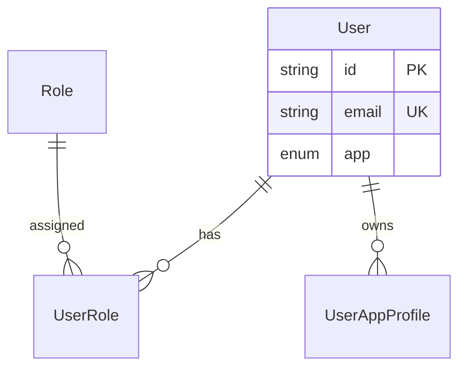

<div align="center">

# Babatunde Yusuf Folorunsho

### Software Engineer · Data Architect · Full-Stack Developer · Mobile & Web3 Builder

I design **data models first**, then build the APIs, mobile apps, and products on top — across insurance, healthcare, gaming, Web3, cultural platforms, and multi-tenant SaaS.

[](https://follyb.vercel.app)
[](https://linkedin.com/in/babatunde-yusuf-folorunsho-390869215)
[](mailto:babatundeyusuffolorunsho@gmail.com)

**Lagos, Nigeria** · Open to remote & hybrid roles

</div>

---

## About Me

I build production software end to end — but I start with the **data layer**. Clear entities, relationships, constraints, and migration paths are what make systems reliable as they scale.

My stack: **Next.js & React** on the frontend, **React Native & Expo** for mobile apps, **Flutter** for cross-platform clients, **Node.js, .NET, and FastAPI** on the backend, **Unity (C#)** for games, **Web3 wallets & multi-chain APIs**, and **PostgreSQL + MongoDB** persistence with **Prisma**, **Mongoose**, and **Entity Framework Core**. I model domains for real products — insurance, telemedicine, chat, gaming, DeFi, event platforms, RBAC systems, bookings — not generic CRUD demos.

---

## Experience

### Software Engineer · Top Insurance Company in Nigeria

**Digital Insurance Platform** — full-stack insurance operations for life and non-life products.

- Built and extended a **modular monolith ASP.NET Core Web API** covering product catalog, quoting, policy lifecycle, payments, claims, and partner onboarding
- Modeled insurance domain data in **PostgreSQL with EF Core** — products, cover types, term rates, quote insured/beneficiary flows, and versioned migrations
- Integrated **TurnKey GIS/LMS** for policy issuance and **Paystack** for payment checkout across life and non-life journeys
- Implemented product availability controls and service-layer filtering to expose selected life products online while keeping the full catalog manageable
- Worked across auth (JWT/Identity), Redis caching, Hangfire jobs, Azure Blob storage, and certificate generation for motor policies

`ASP.NET Core 8` · `Entity Framework Core` · `PostgreSQL` · `Redis` · `Paystack` · `TurnKey` · `Azure` · `Hangfire`

---

### Backend Engineer · MongoDB APIs

**Node/Express backends** backed by **MongoDB + Mongoose** for auth, content, chat, and gaming workflows.

- Built **[Abino_backend](https://github.com/Follyb2810/Abino_backend)** — JWT auth, user registration, and blog CMS APIs with Mongoose schemas and protected routes
- Extended **[Chat_App](https://github.com/Follyb2810/Chat_App)** — MERN real-time chat with MongoDB document models for users, groups, and messages, plus Socket.IO and Redux on the client
- Built **[bet_server](https://github.com/Follyb2810/bet_server)** — TypeScript/Express API with Mongoose models, Socket.IO, background workers, and wallet/payment integrations for a betting platform

`Node.js` · `Express` · `MongoDB` · `Mongoose` · `Socket.IO` · `JWT` · `TypeScript`

---

### Game Developer · Unity

**Unity (C#)** gameplay and systems for mobile-friendly word and action games, with backend APIs where needed.

- Built **ScrableX** — battle-style Scrabble with board generation, zone effects, perks, combo chains, dictionary validation, turn/score managers, and responsive UI
- Developed **[ArrowMen_Unity](https://github.com/Follyb2810/ArrowMen_Unity)** — Unity game project with core gameplay, scene, and asset pipeline setup
- Connected game/product flows to **MongoDB-backed APIs** for auth, messaging, and real-time updates

`Unity` · `C#` · `TextMesh Pro` · `Mobile UI` · `Game Systems` · `REST APIs`

---

### Mobile Application Builder

**Cross-platform mobile apps** with React Native, Expo, Flutter, and Unity for production user experiences.

- Built **[Bet_App](https://github.com/Follyb2810/Bet_App)** — Expo Router mobile app with native navigation, splash screens, and platform-ready UI for a betting product
- Developed **[airbnb-clone-react-native](https://github.com/Follyb2810/airbnb-clone-react-native)** — React Native marketplace app with Clerk auth, maps, clustering, bottom sheets, and Reanimated transitions
- Contributed to **[DigiDokita](https://github.com/DigiDokita)** — Flutter patient/doctor mobile apps connected to telemedicine APIs and clinical data flows
- Shipped **ScrableX** and **[ArrowMen_Unity](https://github.com/Follyb2810/ArrowMen_Unity)** — mobile-friendly Unity games with responsive layouts and touch-first gameplay

`React Native` · `Expo` · `Flutter` · `Unity` · `Mobile UI` · `Clerk` · `Maps`

---

### Web3 Developer

**Wallet-connected apps and blockchain-backed backends** across Ethereum, Solana, Tron, and Cosmos ecosystems.

- Built **[Add-Token](https://github.com/Follyb2810/Add-Token)** — MetaMask dapp for suggesting/importing ERC-20 tokens with wallet provider detection
- Extended **[bet_server](https://github.com/Follyb2810/bet_server)** — multi-chain backend using **Ethers.js**, **Web3.js**, **Solana**, **TronWeb**, and **CosmJS** for wallet flows, auth, and real-time betting events
- Built **[chaincart_v2](https://github.com/Follyb2810/chaincart_v2)** — Web3 commerce frontend with **Abstraxion** wallet integration, on-chain UX, and TanStack Query state
- Backed chain commerce with **[chain_api_v1](https://github.com/Follyb2810/chain_api_v1)** — TypeScript/Express API with MongoDB models for users, products, and marketplace workflows

`Web3` · `MetaMask` · `Ethers.js` · `Solana` · `Tron` · `CosmJS` · `WalletConnect` · `DeFi`

---

## Data Modeling — What I Do

This is the core of how I work. Every project below starts with a schema that reflects the business domain.

| Modeling focus | How I apply it |
|---|---|
| **Entity–relationship design** | Users, roles, appointments, events, bookings — modeled with correct cardinality and foreign keys |
| **Document modeling (MongoDB)** | Users, chats, blogs, bets, and wallet data — flexible schemas with Mongoose validation and indexed lookups |
| **Web3 & on-chain product flows** | Wallet auth, token imports, multi-chain payments, and marketplace APIs across EVM and non-EVM chains |
| **Multi-schema PostgreSQL** | Separate schemas (`public`, `medical`, `user_management`) for domain isolation in healthcare systems |
| **RBAC & multi-tenant identity** | App-scoped roles with composite unique constraints (`userId + roleId + app`) |
| **Enum-driven domains** | `RoleName`, `App`, `UserType`, appointment status — enforced at the database layer |
| **Migration discipline** | SQLite → PostgreSQL upgrades, pooled vs direct URLs, versioned Prisma migrations |
| **Validation at the boundary** | Zod + DTOs aligned with Prisma models so bad data never hits the DB |
| **Seed & fixture strategy** | Reproducible dev/staging data for roles, festivals, admin users, and test patients |

### Example — Multi-app RBAC model

```prisma
enum App { YORUBA_CALENDAR  TAX_FLOW  CLEANING_SERVICE  TICKETING }
enum RoleName { USER  CREATOR  ADMIN  SUPERADMIN  CALENDAR_MANAGER }

model UserRole {
  userId String
  roleId String
  app    App
  @@unique([userId, roleId, app])  // one role per app context
}
```

### Example — Healthcare domain (multi-schema)

```prisma
datasource db {
  provider = "postgresql"
  schemas  = ["medical", "public", "user_management"]
}

model HospitalUser {
  role      String   // STI pattern: Doctor | Patient | LabOfficer
  email     String   @unique
  appointmentsReceived  Appointment[] @relation("recipient")
  appointmentsRequested Appointment[] @relation("requester")
  messagesSent          Message[]
  @@schema("public")
}
```

### Modeling patterns I use regularly

- **Single-table inheritance (STI)** — `HospitalUser.role` for doctor/patient/lab officer variants
- **Soft status fields** — `status`, `account_status`, `verification_status` with audit timestamps
- **Junction tables** — `UserRole`, ticket assignments, festival–Orisa links
- **Audit columns** — `createdAt`, `updatedAt`, `created_by`, `last_modified_by`
- **Indexed lookups** — email, userId, and foreign keys indexed for query performance

---

## Architecture & Diagramming

I document every data model and system design before writing code — using tools that render directly on GitHub.

| Tool | What I use it for |
|------|-------------------|
| **[draw.io](https://app.diagrams.net)** | ER diagrams, C4 architecture, deployment & data flow diagrams |
| **[Mermaid](https://mermaid.js.org)** | ER/sequence/flow charts embedded in GitHub READMEs (no export needed) |
| **[dbdiagram.io (DBML)](https://dbdiagram.io)** | Shareable database schema docs with export to PNG |
| **[PlantUML](https://plantuml.com)** | Sequence diagrams & component diagrams |
| **Prisma Studio / ERD** | Live schema inspection & auto-generated entity graphs |

### Sample diagram repo — host on GitHub

**[data-architecture-diagrams](https://github.com/Follyb2810/follyb2810/tree/main/data-architecture-diagrams)** — sample project with `.drawio`, Mermaid, DBML, and PlantUML files for Platform API, Video Call API, Yoruba Calendar, and PCSS.



> Open `.drawio` files in [diagrams.net](https://app.diagrams.net) → export SVG → embed in any README.

---

## Featured Projects

### [Data Architecture Diagrams](https://github.com/Follyb2810/follyb2810/tree/main/data-architecture-diagrams)
Portfolio repo of ER diagrams, system architecture, and data flows — **draw.io**, **Mermaid**, **DBML**, **PlantUML** — mapped to real projects.

**Includes:** Platform API RBAC · Video Call telemedicine · Yoruba Calendar · PCSS content model

`draw.io` · `Mermaid` · `DBML` · `PlantUML` · `GitHub-hosted`

---

### [DigiDokita Video Call & Chat API](https://github.com/DigiDokita/digi_consultation)
Real-time telemedicine backend — video sessions, live chat, appointment scheduling, and notifications for doctors and patients.

**Data modeling:** Multi-schema PostgreSQL (`medical`, `public`, `user_management`), STI user hierarchy, appointment/message relations, activity logs.

`Node.js` · `TypeScript` · `PostgreSQL` · `Prisma` · `Socket.io` · `Redis` · `RabbitMQ` · `WebRTC` · `JWT`

---

### [Platform API v2 — Multi-Tenant Backend](https://github.com/Follyb2810/platform_api_v2)
Shared backend powering multiple products with unified identity and app-scoped authorization.

**Data modeling:** Central `User` + `Role` + `UserRole` with `App` enum; per-app profiles via `UserAppProfile`; festival/Orisa/ticket domain entities.

`Node.js` · `TypeScript` · `PostgreSQL` · `Prisma` · `Clean Architecture`

---

### [Kọ́jọ́dá — Yoruba Calendar Platform](https://github.com/Follyb2810/yoruba_calendar)
Community platform for Yoruba festivals, Orisa references, event ticketing, and cultural content management.

**Data modeling:** Orisa → Festival relations, role-based event publishing, order/ticket entities, OAuth-linked user accounts.

`Next.js 16` · `PostgreSQL` · `Prisma 7` · `NextAuth` · `Paystack`

---

### [Proficients Cares (PCSS)](https://github.com/Follyb2810/pcs)
Full-stack nonprofit site with inquiries, events, gallery, testimonials, and admin CMS.

**Data modeling:** Normalized content models (`Event`, `Inquiry`, `GalleryItem`, `Testimonial`, `SiteSettings`) with status workflows.

`Next.js 16` · `PostgreSQL` · `Prisma` · `TanStack Query` · `Docker`

---

### [DigiDokita — Healthcare Ecosystem](https://github.com/DigiDokita)
Broader telemedicine work — patient–doctor mobile apps, AI-assisted nursing, and clinical data flows.

**Data modeling:** Patient health records, test results, triage data, notification preferences per user type.

`FastAPI` · `Flutter` · `Prisma` · `scikit-learn` · `PostgreSQL`

---

### [Cleaning Service API](https://github.com/Follyb2810/CleaningServiceAPI)
.NET API for bookings, subscriptions, cleaner assignment, and service lifecycle management.

**Data modeling:** EF Core entities for Customer/Cleaner/Admin roles, booking state machine, subscription plans.

`ASP.NET Core 8` · `Entity Framework Core` · `PostgreSQL` · `JWT`

---

### [Abino Backend — MongoDB API](https://github.com/Follyb2810/Abino_backend)
Express backend for authentication, user management, and blog content.

**Data modeling:** Mongoose schemas for users and blog posts with JWT-protected routes and refresh flows.

`Node.js` · `Express` · `MongoDB` · `Mongoose` · `JWT`

---

### [Chat App — MERN Backend](https://github.com/Follyb2810/Chat_App)
Real-time chat platform with group messaging, notifications, and auth.

**Data modeling:** MongoDB collections for users, chats, and group membership with Socket.IO event streams.

`Node.js` · `MongoDB` · `Mongoose` · `Socket.IO` · `React` · `Redux`

---

### [Bet Server — Gaming API](https://github.com/Follyb2810/bet_server)
TypeScript backend for a betting platform with wallets, workers, and real-time updates.

**Data modeling:** Mongoose document models for users, bets, and transactions with queue-driven processing.

`TypeScript` · `Express` · `MongoDB` · `Mongoose` · `Socket.IO` · `Bull`

---

### ScrableX — Unity Battle Scrabble
Mobile-friendly Unity word-battle game with zone-based mechanics and advanced board modes.

**Game systems:** Board generation, tile placement, dictionary validation, perks, traps, freeze effects, and match flow.

`Unity` · `C#` · `TextMesh Pro` · `Mobile UI`

---

### [ArrowMen Unity](https://github.com/Follyb2810/ArrowMen_Unity)
Unity game project with gameplay assets, scenes, and project configuration.

`Unity` · `C#`

---

### [Bet App — Expo Mobile](https://github.com/Follyb2810/Bet_App)
Cross-platform mobile app for a betting product with Expo Router and native-ready navigation.

`React Native` · `Expo` · `TypeScript`

---

### [Airbnb Clone — React Native](https://github.com/Follyb2810/airbnb-clone-react-native)
Mobile marketplace clone with Clerk auth, map clustering, bottom sheets, and animated UI.

`React Native` · `Expo` · `Clerk` · `Reanimated` · `Maps`

---

### [Add-Token — Web3 Dapp](https://github.com/Follyb2810/Add-Token)
MetaMask dapp for suggesting and importing custom ERC-20 tokens into compatible wallets.

`React` · `MetaMask` · `Web3` · `Etherscan`

---

### [ChainCart v2 — Web3 Commerce](https://github.com/Follyb2810/chaincart_v2)
On-chain commerce frontend with wallet connection, product flows, and modern React UI.

`Next.js` · `Abstraxion` · `Web3` · `TanStack Query` · `Zustand`

---

### [Chain API v1 — Web3 Backend](https://github.com/Follyb2810/chain_api_v1)
TypeScript API backing chain-commerce flows with MongoDB models and JWT auth.

`TypeScript` · `Express` · `MongoDB` · `Mongoose` · `Zod`

---

## What I Bring to a Team

| Software Engineering | Data Architecture & Modeling |
|---|---|
| Full-stack apps with Next.js, React, TypeScript | Relational schema design (PostgreSQL, Prisma, EF Core) |
| React Native, Expo, and Flutter mobile apps | Document modeling with MongoDB & Mongoose |
| Unity game systems, mobile UI, and C# gameplay logic | Multi-schema layouts & domain-driven table design |
| Web3 dapps, wallet flows, and multi-chain backends | RBAC models, STI patterns, composite constraints |
| REST APIs, real-time (Socket.io), admin dashboards | Web3 commerce and wallet-integrated product design |
| Dockerized deployments & CI-ready workflows | Migration governance, seed strategies, Zod validation |
| Healthcare, insurance, gaming, DeFi & marketplace experience | SQLite → Postgres upgrade paths & connection pooling |
| Architecture docs with draw.io, Mermaid, DBML | ER diagrams, sequence flows, schema docs on GitHub |

---

## Tech Stack

**Languages**


**Frontend**


**Backend, Data & Web3**


**Architecture & Diagramming**


---

## GitHub Activity

<div align="center">

[](https://github.com/Follyb2810)
[](https://github.com/Follyb2810)

</div>

---

## Currently Learning & Exploring

- PostgreSQL indexing, query plans, and performance tuning
- Event-driven architecture for multi-tenant data platforms
- ML feature pipelines integrated with clinical data models

---

## Let's Connect

Open to **Software Engineer**, **Mobile Application Builder**, **Web3 Developer**, **Data Architect**, and **Full-Stack Developer** roles — especially where schema design, API platforms, mobile apps, or blockchain products matter.

[](https://github.com/Follyb2810)
[](https://follyb.vercel.app)
[](https://linkedin.com/in/babatunde-yusuf-folorunsho-390869215)
[](https://twitter.com/babatunde2810)
[](https://medium.com/@follyb2810)

---

<div align="center">

*"Good software starts with good data models."*

</div>
