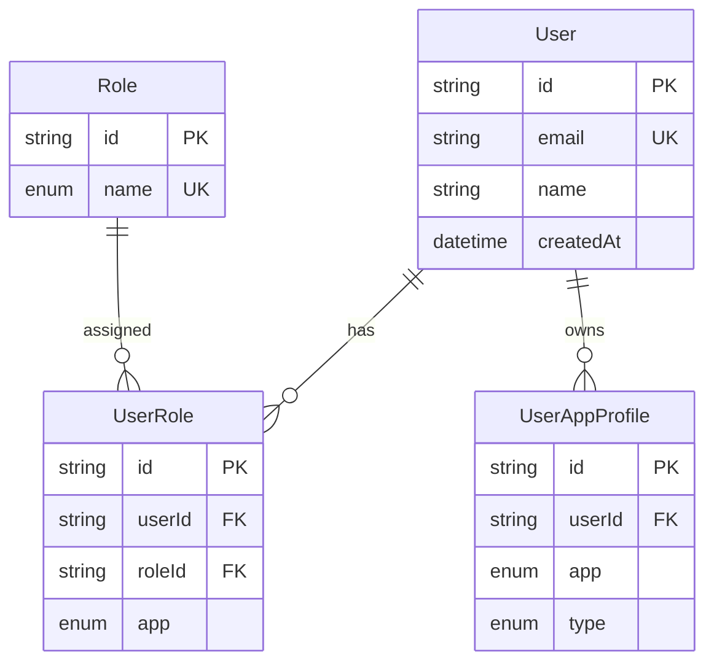
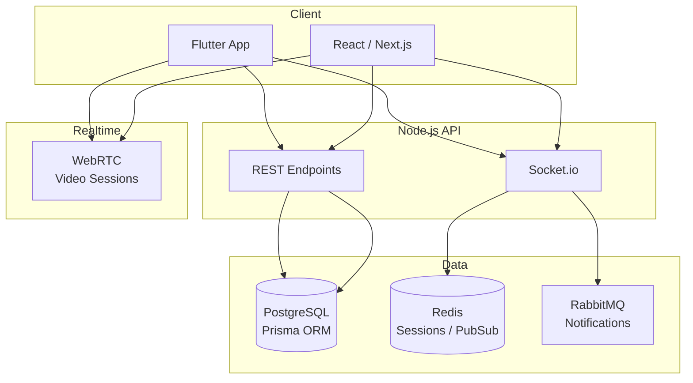

# Data Architecture Diagrams

Sample **ER diagrams**, **system architecture**, and **data flow** diagrams for real projects — built with **draw.io**, **Mermaid**, **DBML**, and **PlantUML**. Designed to be hosted on GitHub and linked from your portfolio or profile README.

> **Author:** [Babatunde Yusuf Folorunsho](https://github.com/Follyb2810) · Software Engineer & Data Architect

---

## What's inside

| Folder | Tool | GitHub-friendly? | Best for |
|--------|------|------------------|----------|
| [`diagrams/drawio/`](diagrams/drawio/) | [draw.io / diagrams.net](https://app.diagrams.net) | Edit in repo; export SVG/PNG for README | ER diagrams, architecture, flows |
| [`diagrams/mermaid/`](diagrams/mermaid/) | [Mermaid](https://mermaid.js.org) | Renders natively in GitHub Markdown | ER diagrams, sequence & flow charts |
| [`diagrams/dbml/`](diagrams/dbml/) | [dbdiagram.io](https://dbdiagram.io) | Paste into dbdiagram; export PNG | Database schema docs |
| [`diagrams/plantuml/`](diagrams/plantuml/) | [PlantUML](https://plantuml.com) | Use GitHub Action or export SVG | Sequence & component diagrams |
| [`exports/`](exports/) | Exported SVG/PNG | Embed directly in README | Profile & repo previews |

---

## Sample projects covered

1. **Platform API v2** — Multi-app RBAC (`User`, `Role`, `UserRole`, `UserAppProfile`)
2. **DigiDokita Video Call API** — Telemedicine architecture (WebRTC, Socket.io, Redis, RabbitMQ)
3. **Yoruba Calendar** — Orisa → Festival → Ticket domain model
4. **Proficients Cares (PCSS)** — CMS content entities & inquiry workflow

---

## Preview — Platform API RBAC (Mermaid)

GitHub renders this automatically when you paste Mermaid in any `.md` file:



---

## Preview — Video Call System Architecture (Mermaid)



---

## How to host on GitHub

### Option A — Mermaid (easiest, no export needed)

1. Copy any file from `diagrams/mermaid/` into your repo README
2. Wrap in ` ```mermaid ` code fences
3. Push — GitHub renders it automatically

### Option B — draw.io files in the repo

1. Open any `.drawio` file at [app.diagrams.net](https://app.diagrams.net)
   - **File → Open from → GitHub** (connect your account), or
   - Upload the file locally
2. Edit and save back to the repo (VS Code draw.io extension works too)
3. **File → Export as → SVG** → save to `exports/`
4. Embed in README:

```markdown

```

### Option C — dbdiagram.io

1. Open [dbdiagram.io](https://dbdiagram.io)
2. Paste contents of `diagrams/dbml/platform-api-rbac.dbml`
3. Export PNG → add to `exports/`
4. Link from your profile README

### Option D — PlantUML

1. Paste `diagrams/plantuml/video-call-sequence.puml` into [plantuml.com/plantuml](https://www.plantuml.com/plantuml)
2. Export SVG → save to `exports/`
3. Or use the [PlantUML GitHub Action](https://github.com/marketplace/actions/generate-plantuml-diagrams) for auto-generation on push

---

## Quick start — publish this repo

```bash
cd data-architecture-diagrams
git init
git add .
git commit -m "Add data architecture diagram samples (draw.io, Mermaid, DBML, PlantUML)"
gh repo create Follyb2810/data-architecture-diagrams --public --source=. --push
```

Or create the repo on GitHub first, then:

```bash
git remote add origin https://github.com/Follyb2810/data-architecture-diagrams.git
git push -u origin main
```

---

## Tools I use for data modeling & diagrams

| Tool | Use case |
|------|----------|
| **draw.io** | ER diagrams, C4 architecture, deployment diagrams |
| **Mermaid** | Quick ER/flow diagrams in GitHub READMEs |
| **dbdiagram.io (DBML)** | Shareable database schema documentation |
| **PlantUML** | Sequence diagrams, component diagrams |
| **Prisma Studio** | Inspect live schema & relationships |
| **Prisma ERD Generator** | Auto-generate ER from `schema.prisma` |

---

## Related repos

- [platform_api_v2](https://github.com/Follyb2810/platform_api_v2) — Multi-tenant backend
- [digi_consultation](https://github.com/DigiDokita/digi_consultation) — Video call & chat API
- [yoruba_calendar](https://github.com/Follyb2810/yoruba_calendar) — Cultural events platform
- [pcs](https://github.com/Follyb2810/pcs) — Proficients Cares website

---

## License

MIT — free to use, fork, and adapt for your portfolio.
