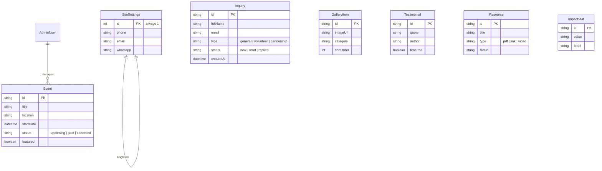
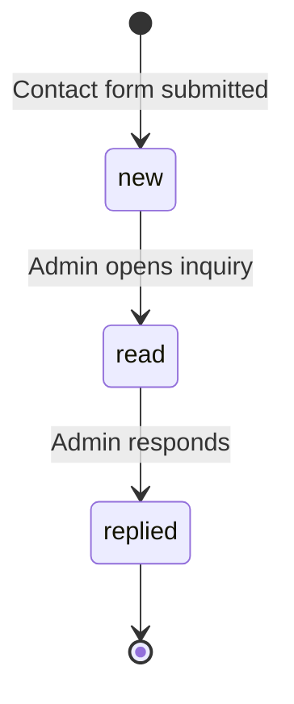

# Proficients Cares (PCSS) — Content & Inquiry Model

```mermaid
erDiagram
    AdminUser ||--o{ Event : manages
    SiteSettings ||--|| SiteSettings : singleton

    Event {
        string id PK
        string title
        string location
        datetime startDate
        string status "upcoming | past | cancelled"
        boolean featured
    }

    Inquiry {
        string id PK
        string fullName
        string email
        string type "general | volunteer | partnership"
        string status "new | read | replied"
        datetime createdAt
    }

    GalleryItem {
        string id PK
        string imageUrl
        string category
        int sortOrder
    }

    Testimonial {
        string id PK
        string quote
        string author
        boolean featured
    }

    Resource {
        string id PK
        string title
        string type "pdf | link | video"
        string fileUrl
    }

    ImpactStat {
        string id PK
        string value
        string label
    }

    SiteSettings {
        int id PK "always 1"
        string phone
        string email
        string whatsapp
    }
```

## Inquiry workflow

```mermaid
stateDiagram-v2
    [*] --> new: Contact form submitted
    new --> read: Admin opens inquiry
    read --> replied: Admin responds
    replied --> [*]
```
