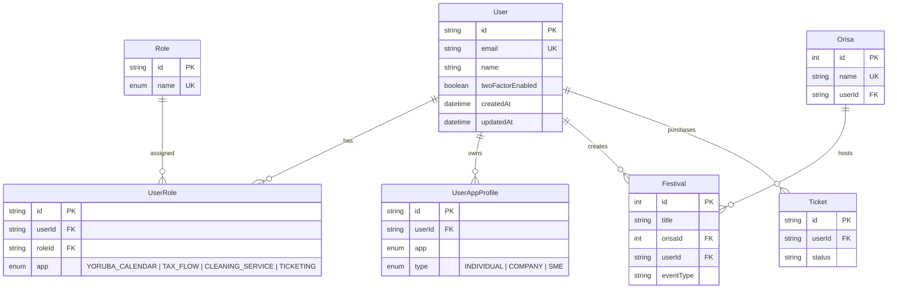

# Platform API v2 — RBAC Entity Relationship

## Apps & roles

| App | Example roles |
|-----|---------------|
| `YORUBA_CALENDAR` | USER, CREATOR, CALENDAR_MANAGER, ADMIN |
| `CLEANING_SERVICE` | USER, CLEANING_MANAGER, ADMIN |
| `TICKETING` | USER, TICKET_MANAGER, ADMIN |
| `TAX_FLOW` | USER, TAX_MANAGER, ADMIN |
