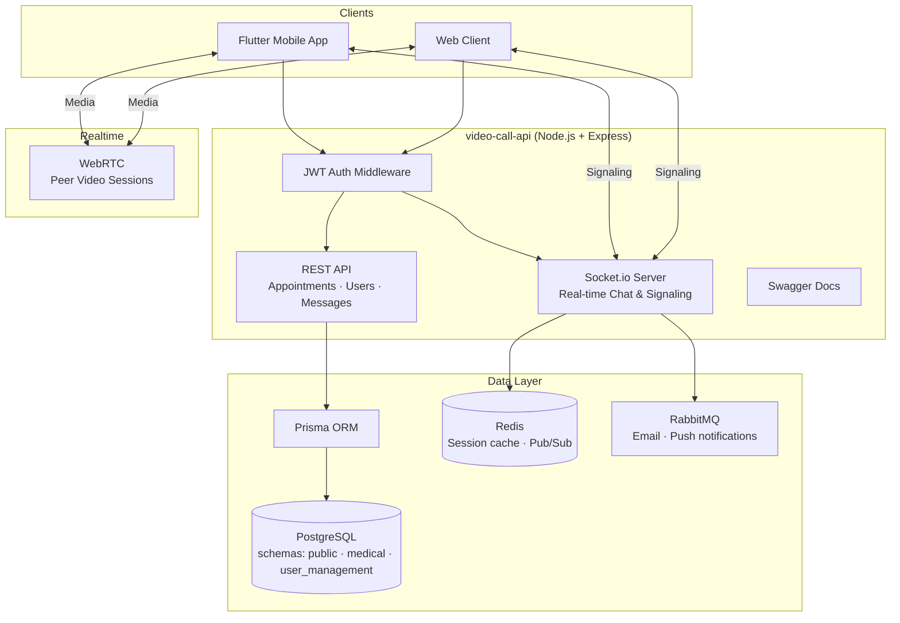
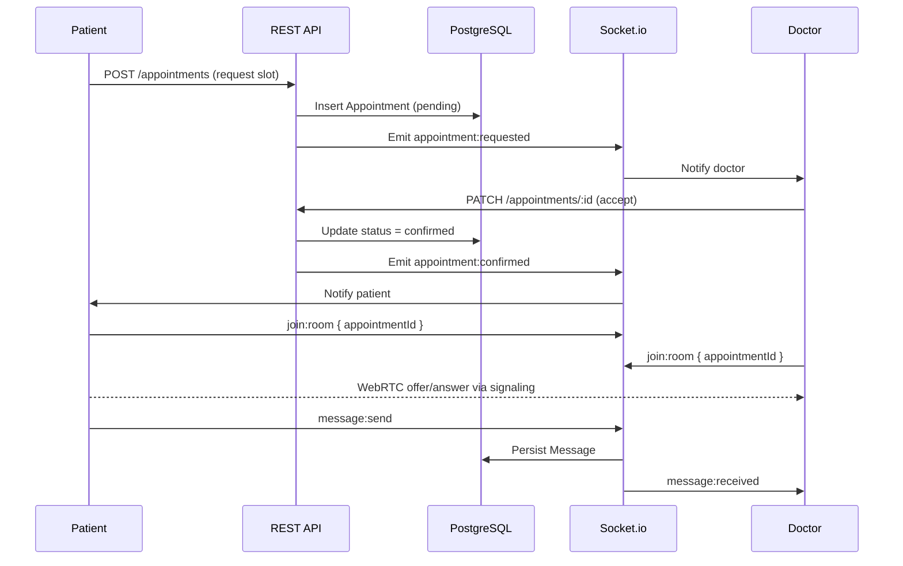

# DigiDokita Video Call — System Architecture

```mermaid
flowchart TB
    subgraph Clients
        Flutter[Flutter Mobile App]
        WebApp[Web Client]
    end

    subgraph API["video-call-api (Node.js + Express)"]
        Auth[JWT Auth Middleware]
        REST[REST API\nAppointments · Users · Messages]
        Socket[Socket.io Server\nReal-time Chat & Signaling]
        Swagger[Swagger Docs]
    end

    subgraph Realtime
        WebRTC[WebRTC\nPeer Video Sessions]
    end

    subgraph DataLayer["Data Layer"]
        Prisma[Prisma ORM]
        PG[(PostgreSQL\nschemas: public · medical · user_management)]
        Redis[(Redis\nSession cache · Pub/Sub)]
        RabbitMQ[RabbitMQ\nEmail · Push notifications]
    end

    Flutter --> Auth
    WebApp --> Auth
    Auth --> REST
    Auth --> Socket
    REST --> Prisma
    Socket --> Redis
    Socket --> RabbitMQ
    Prisma --> PG
    Flutter <-->|Signaling| Socket
    WebApp <-->|Signaling| Socket
    Flutter <-->|Media| WebRTC
    WebApp <-->|Media| WebRTC
```

## Appointment & message flow

```mermaid
sequenceDiagram
    participant P as Patient
    participant API as REST API
    participant DB as PostgreSQL
    participant S as Socket.io
    participant D as Doctor

    P->>API: POST /appointments (request slot)
    API->>DB: Insert Appointment (pending)
    API->>S: Emit appointment:requested
    S->>D: Notify doctor

    D->>API: PATCH /appointments/:id (accept)
    API->>DB: Update status = confirmed
    API->>S: Emit appointment:confirmed
    S->>P: Notify patient

    P->>S: join:room { appointmentId }
    D->>S: join:room { appointmentId }
    P-->>D: WebRTC offer/answer via signaling
    P->>S: message:send
    S->>DB: Persist Message
    S->>D: message:received
```
