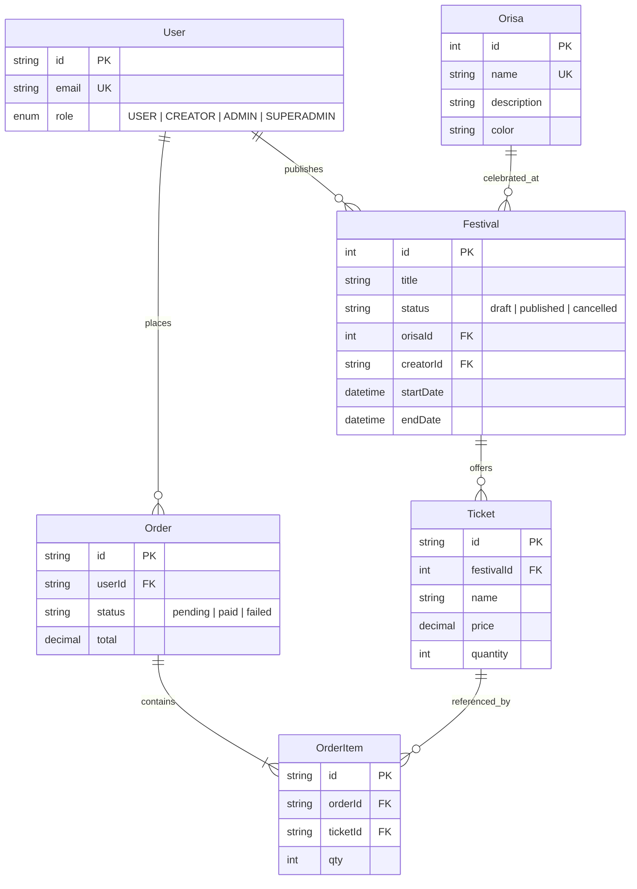
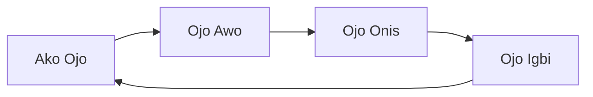

# Yoruba Calendar — Domain Model

```mermaid
erDiagram
    User ||--o{ Festival : publishes
    User ||--o{ Order : places
    Orisa ||--o{ Festival : celebrated_at
    Festival ||--o{ Ticket : offers
    Order ||--|{ OrderItem : contains
    Ticket ||--o{ OrderItem : referenced_by

    User {
        string id PK
        string email UK
        enum role "USER | CREATOR | ADMIN | SUPERADMIN"
    }

    Orisa {
        int id PK
        string name UK
        string description
        string color
    }

    Festival {
        int id PK
        string title
        string status "draft | published | cancelled"
        int orisaId FK
        string creatorId FK
        datetime startDate
        datetime endDate
    }

    Ticket {
        string id PK
        int festivalId FK
        string name
        decimal price
        int quantity
    }

    Order {
        string id PK
        string userId FK
        string status "pending | paid | failed"
        decimal total
    }

    OrderItem {
        string id PK
        string orderId FK
        string ticketId FK
        int qty
    }
```

## Calendar week cycle

```mermaid
flowchart LR
    A[Ako Ojo] --> B[Ojo Awo]
    B --> C[Ojo Onis]
    C --> D[Ojo Igbi]
    D --> A
```
